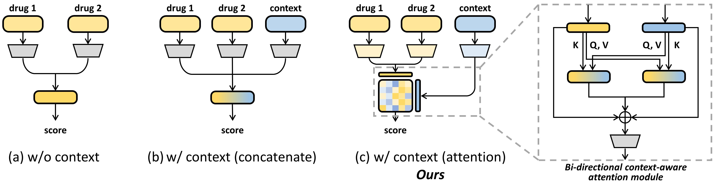

# CabidaDDI

This repository provides the source code for the ICLR'24 Tiny paper **Enhancing Drug-Drug Interaction Prediction with Context-Aware Architecture**. 

In this paper, we propose a Context-Aware-BIDirectional-Attention Architecture for DDI (CabidaDDI) to improve context-conditioned DDI prediction.

## Environments
We utilize the datasets in [Chemicalx](https://github.com/AstraZeneca/chemicalx) for a fair comparison, please make sure chemicalx is installed in your enviroment.

<pre>
<code>
pip install torch-scatter -f https://pytorch-geometric.com/whl/torch-1.10.0+${CUDA}.html
pip install torchdrug
pip install chemicalx
</code>
</pre>

## Experiments

You can easily run our model under random split setting with the code below.

<pre>
<code>
python run_cabidaDDI.py --epochs 80 --dataset drugcombdb --repeat 3
</code>
</pre>

## Cite Us

<pre>
<code>
@inproceedings{lu2024enhancing,
  title={Enhancing Drug-Drug Interaction Prediction with Context-Aware Architecture},
  author={Lu, Yijingxiu and Piao, Yinhua and Kim, Sun},
  booktitle={The Second Tiny Papers Track at ICLR 2024}
}
</code>
</pre>